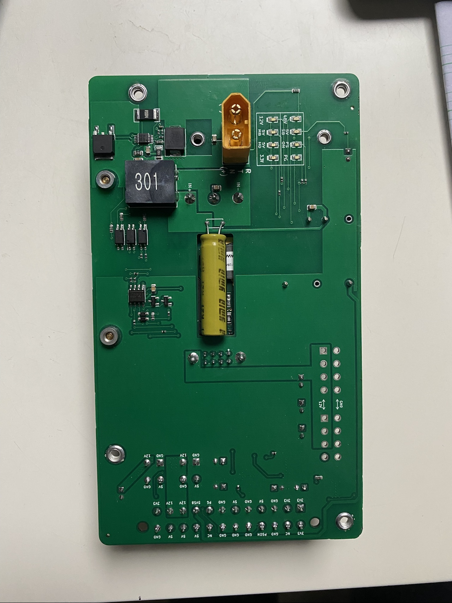
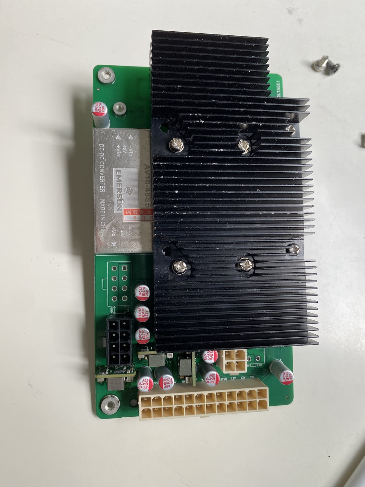
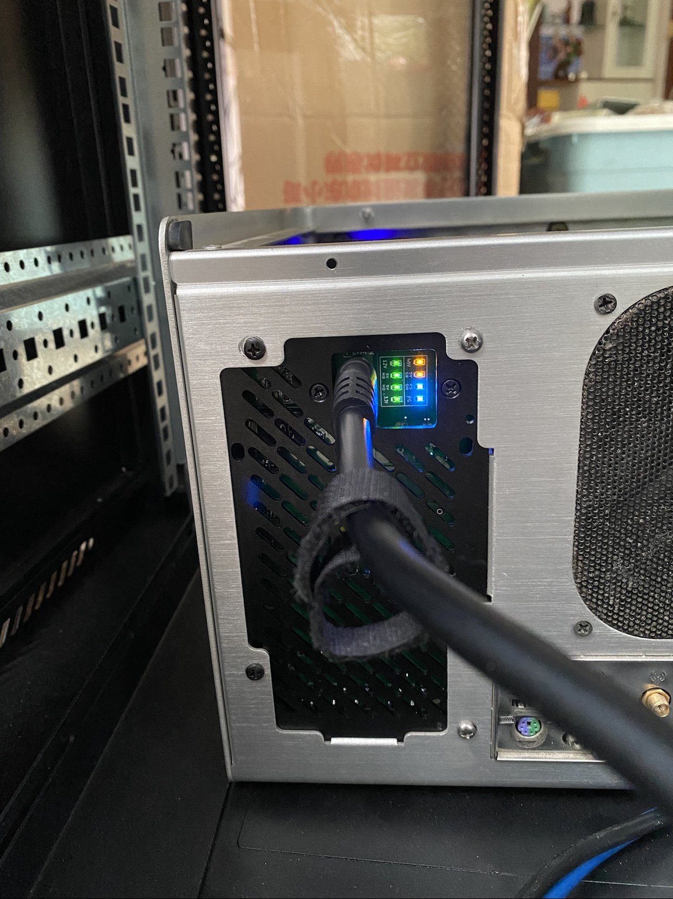

# ATX48: 48V DC-ATX Power Supply

An isolated 44V-70V to ATX power supply. Built for DC UPS systems for your home datacenter.

## Structure

## Features

### Hot Plug with Soft Start

LM5067 hot swap controller is used to limit inrush current, eliminating any sparks on hot-plug. It also limits input current to 10A, protecting over-current situations.

### High efficiency conversion

[Huawei GDQ33S12B/P](https://www.huaweipowersolutions.com/GDQ33S12B(P).pdf) is used as the main converter. It provides 12V/33A output with up to 96.0% efficiency.

For 3.3V and 5V, three ZXDN10 modules are used (3.3V motherboard, 5V motherboard, 5V HDD), with up to 94% efficiency (See [testing](https://blog.iccfish.com/2021/08/02/%E7%9B%98%E4%B8%80%E4%B8%8B%E6%9C%80%E8%BF%91%E6%94%B6%E5%88%B0%E7%9A%84%E4%BA%8C%E6%89%8Bdc%E9%9D%9E%E9%9A%94%E7%A6%BB%E9%99%8D%E5%8E%8B%E6%A8%A1%E5%9D%97/)).

5VSB voltage is provided by an AV10-48S05 module, with up to 10W standby power output. The main converter is disabled in standby mode to avoid unnecessary energy waste when PC is off.

This power supply does not provide -12V and -5V output, because no motherboards use them today.

### Fully isolated
Input and output are fully isolated. Works within either +48V or -48V setup.

### LED indicators

Built with 8 LED indicators to monitor input and output status (see photos below).

### ATX installation

Installs to any chassis with ATX power slot.

## Connectors

### Input

An XT60PB-M connector is present on board. Use any XT60 compatible connector as power input.

### Output

This power supply provides the following power outputs:

* 1 \* ATX 24-Pin
* 2 \* 8-Pin 12V for CPU and PCIe
* 2 \* 4-Pin for SATA

For 24-Pin ATX power output, use a 24P to 24P cable with identical pinouts.

For SATA HDD/SDD power output, use Lenovo 4-Pin to SATA connector, such as [this](https://www.amazon.com/Genuine-Lenovo-7-5mm-Power-54Y8286/dp/B07DL9P1V7).

For PCIe / CPU 8-Pin power, use 12V modular cables for Seasonic FOCUS+/KM3/XP2/XM2/XP3 series.
 
## Photos

  
